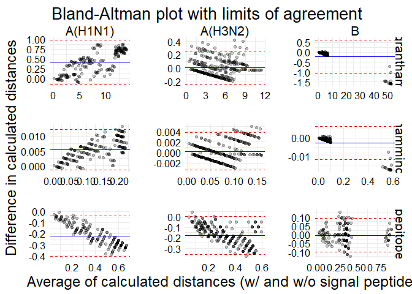

<!-- README.md is generated from README.qmd. Please edit that file -->

# p-epitope-test

<!-- badges: start -->

<!-- badges: end -->

In Amanda’s antigenic distance code, she always removed the signal
peptide from the beginning of the influenza HA sequences, but I forgot
to do that. In this repo I’ll try to figure out whether that actually
matters. To that end, I’ll compute the $p$-epitope, Grantham, and
Hamming distances both ways and examine the correlations with and
without removing the signal peptide. I’ll also try to examine the source
papers for the $p$-epitope metric and other antigenic distance papers to
find out if there is a specific source for removing the signal peptide.
All of the results will be included in this README.

## Signal peptide lengths

Signal peptide length sources:

``` r
# Create a lookup table of the signal peptide lengths
signal_peptide_lengths <- tibble::tribble(
    ~type_subtype, ~sp_length,
    "A(H1N1)", 18L,
    "A(H3N2)", 17L,
    "B"      , 15L
)

signal_peptide_lengths |>
    `colnames<-`(c("Type (Subtype)", "Signal peptide length (AA)")) |>
    tinytable::tt()
```

| Type (Subtype) | Signal peptide length (AA) |
|----------------|----------------------------|
| A(H1N1)        | 18                         |
| A(H3N2)        | 17                         |
| B              | 15                         |

## Data loading and cleaning

First we need to load the raw sequences data. I took this from the
[Influenza antigenic distance
repository](https://github.com/ahgroup/influenza-antigenic-distance-data/blob/33d9b7607176207cc37de23df1c7bfa84705673b/data/raw/raw-sequences.xlsx)
on 2025-05-21. The cleaning code is copied and/or adapted [from that
repository as
well](https://github.com/ahgroup/influenza-antigenic-distance-data/blob/33d9b7607176207cc37de23df1c7bfa84705673b/R/sequence-alignment.R).

``` r
# First load the sequences
raw_sequence_data <- readxl::read_xlsx(here::here("data", "raw-sequences.xlsx"))

# And apply the cleaning and alignment functions
sequence_data <-
    raw_sequence_data |>
    clean_sequence_data() |>
    align_sequence_data()

# Now create the sequences with no signal peptide
sequence_data_sp <-
    sequence_data |>
    dplyr::left_join(signal_peptide_lengths, by = "type_subtype") |>
    dplyr::mutate(
        seq_no_sp = stringr::str_sub(protein_sequence, sp_length, -1),
        aligned_sequence_length_no_peptide = nchar(seq_no_sp)
    )

# Now pivot the data so we can compute everything more easily
sequence_data_long <-
    sequence_data_sp |>
    tidyr::pivot_longer(
        c(protein_sequence, seq_no_sp),
        names_to = "has_signal_peptide",
        values_to = "protein_sequence"
    ) |>
    dplyr::mutate(
        has_signal_peptide = factor(
            has_signal_peptide,
            levels = c("protein_sequence", "seq_no_sp"),
            labels = c("Yes", "No")
        )
    )
```

## Distance calculation

Next we calculate the distances

write some descriptions here

``` r
nested_distance_data <-
    sequence_data_long |>
    dplyr::select(
        type_subtype, strain_name, protein_sequence, has_signal_peptide
    ) |>
    tidyr::nest(sequence_data = c(strain_name, protein_sequence)) |>
    dplyr::mutate(
        dist_pepitope = purrr::map2(
            sequence_data, type_subtype,
            \(d, s) dist_pepi(d$protein_sequence, s)
        ),
        dist_grantham = purrr::map(
            sequence_data,
            \(d) dist_substitution(
                d$protein_sequence,
                # Count gaps as ambiguous since there's no defined physiochemical
                # penalty for a gap vs an amino acid
                ambiguous_residues = c("xX?-"),
                method = "grantham"
            )
        ),
        dist_hamming = purrr::map(
            sequence_data,
            \(d) dist_string(
                d$protein_sequence,
                method = "hamming"
            ) |> as.matrix()
        ),
        # Set dimension names for all of the distance matrices to be the strain
        # names instead of numbers.
        dplyr::across(
            dplyr::contains("dist_"),
            \(col) purrr::map2(
                col, sequence_data,
                \(x, d) set_square_matrix_dimnames(x, d$strain_name)
            )
        )
    )

final_dist_data <-
    nested_distance_data |>
    tidy_joined_distances() |>
    dplyr::select(-sequence_data) |>
    dplyr::mutate(
        straincomb = purrr::map2(Strain1, Strain2, \(x, y) sort(as.character(c(x, y))))
    ) |>
    dplyr::distinct(
        type_subtype, has_signal_peptide, straincomb, metric, d, .keep_all = TRUE
    ) |>
    dplyr::select(-straincomb)
```

## Comparisons

``` r
final_dist_data |>
    tidyr::nest(dat = c(Strain1, Strain2, d, has_signal_peptide)) |>
    dplyr::mutate(
        ttest = purrr::map(dat, \(x) t.test(d ~ has_signal_peptide, data = x)),
        p = purrr::map_dbl(ttest, \(x) x$p.value)
    )
#> # A tibble: 9 × 5
#>   type_subtype metric   dat                ttest          p
#>   <fct>        <fct>    <list>             <list>     <dbl>
#> 1 A(H1N1)      grantham <tibble [462 × 4]> <htest> 3.82e- 1
#> 2 A(H1N1)      hamming  <tibble [462 × 4]> <htest> 4.69e- 1
#> 3 A(H1N1)      pepitope <tibble [462 × 4]> <htest> 3.33e-20
#> 4 A(H3N2)      grantham <tibble [650 × 4]> <htest> 9.80e- 1
#> 5 A(H3N2)      hamming  <tibble [650 × 4]> <htest> 9.58e- 1
#> 6 A(H3N2)      pepitope <tibble [650 × 4]> <htest> 1.05e-29
#> 7 B            grantham <tibble [420 × 4]> <htest> 8.82e- 1
#> 8 B            hamming  <tibble [420 × 4]> <htest> 8.68e- 1
#> 9 B            pepitope <tibble [420 × 4]> <htest> 9.02e- 1
```

``` r
library(ggplot2)

dat_plot <-
    final_dist_data |>
    dplyr::filter(d != 0) |>
    tidyr::pivot_wider(
        names_from = has_signal_peptide,
        names_prefix = "d_",
        values_from = d
    )

dat_plot |>
    ggplot2::ggplot() +
    ggplot2::aes(x = d_Yes, y = d_No) +
    ggplot2::geom_point(alpha = 0.1) +
    ggplot2::facet_grid(metric ~ type_subtype) +
    ggplot2::labs(
        x = "Distance including signal peptide",
        y = "Distance not including signal peptide"
    ) +
    ggplot2::theme_minimal()
#> Warning: Removed 2 rows containing missing values or values outside the scale range
#> (`geom_point()`).
```


``` r
dat_ba <-
    dat_plot |>
    dplyr::mutate(
        avg = (d_Yes + d_No) / 2,
        diff = d_Yes - d_No
    )

loa <- dat_ba |>
    dplyr::summarize(
        mean = mean(diff, na.rm = TRUE),
        lower_loa = mean - 1.96 * sd(diff, na.rm = TRUE),
        upper_loa = mean + 1.96 * sd(diff, na.rm = TRUE),
        .by = c(metric, type_subtype)
    )

dat_ba |>
    ggplot2::ggplot() +
    ggplot2::aes(x = avg, y = diff) +
    ggplot2::geom_hline(
        data = loa,
        ggplot2::aes(yintercept = mean),
        color = "blue"
    ) +
    ggplot2::geom_hline(
        data = loa,
        ggplot2::aes(yintercept = lower_loa),
        color = "red", lty = 2
    ) +
    ggplot2::geom_hline(
        data = loa,
        ggplot2::aes(yintercept = upper_loa),
        color = "red", lty = 2
    ) +
    ggplot2::geom_point(alpha = 0.25) +
    ggplot2::labs(
        x = "Average of calculated distances (w/ and w/o signal peptide)",
        y = "Difference in calculated distances",
        title = "Bland-Altman plot with limits of agreement"
    ) +
    ggh4x::facet_grid2(metric ~ type_subtype, scales = "free", independent = "all") + 
    hgp::theme_ms()
#> Warning: Removed 2 rows containing missing values or values outside the scale range
#> (`geom_point()`).
```


